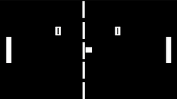
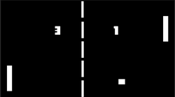
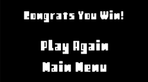

# 🏓 Pong Clone

A classic Pong Clone developed in **Unity** as part of my game development learning journey. Originally created on **12 December 2024**, this project has been revisited and polished to improve the gameplay experience, project structure, and mobile support.


---

## 📖 Overview

Pong Clone recreates the iconic arcade game while focusing on the core mechanics of gameplay programming. The project was built to strengthen my understanding of Unity, C#, physics, collision handling, UI systems, and game state management.

As part of rebuilding my portfolio, I revisited this project to refactor the code, improve the controls, and make it playable on both desktop and mobile browsers.

**Created:** 12 December 2024

---

## 🎮 Features

- 🏓 Classic Pong gameplay
- 🤖 Player vs AI opponent
- 🎯 Ball physics & collision handling
- 📊 Score tracking system
- 🎵 Background music & sound effects
- 🖥️ Keyboard controls
- 📱 Smooth drag controls for Android
- 🌐 Mobile browser (WebGL) support
- 🏆 Win & Lose game states

---

## 📸 Gameplay

### Gameplay



### Mobile Controls



### Win Screen



---

## 📂 Project Structure

```
Assets
└── Scripts
    ├── Ball.cs
    ├── DragInput.cs
    ├── LevelManager.cs
    ├── MusicManager.cs
    ├── playercontroller1.cs
    └── ScoreManager.cs

Images
├── Gameplay1.png
├── Gameplay2.png
├── Logo.png
└── WinMenu.png
```

---

## 🛠️ Built With

- Unity
- C#
- Visual Studio

---

## 📚 What I Learned

During this project I gained practical experience with:

- Unity fundamentals
- C# scripting
- 2D Physics
- Collision detection
- UI programming
- Scene Management
- AI paddle behaviour
- Mobile touch input
- Game architecture improvements
- Project refactoring

---

## 🚀 Future Improvements

- Better AI difficulty
- Pause Menu
- Settings Menu
- Visual polish
- Particle effects
- Improved UI animations

---

## 🔗 Links

### 🌐 Portfolio

https://abikarthickgdev.github.io/GAMEDEV_PORTFOLIO/

### 💻 GitHub Repository

https://github.com/ABIKARTHICKGDEV/Pong-clone

### 💼 LinkedIn Project Post

https://www.linkedin.com/posts/abikarthick_unity-unity3d-gamedevelopment-ugcPost-7487058370764513280-D8Ie/

---

## 👨‍💻 Developer

**ABIKARTHICK**

Game Developer | Unity Developer

---

If you found this project interesting, consider giving the repository a ⭐.